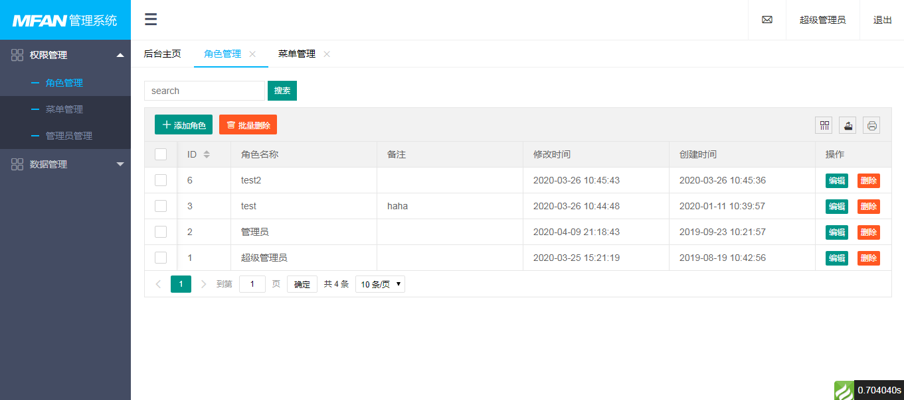

# 权限管理系统

一个 基于TP5框架 的 权限管理系统

## 更新

- 202008-28 修复admin/model.admin.php代码

- 2020-04-14 修复账号启用问题 

- 2020-04-09 初版本完成

## 使用

- 下载源码

- 添加我的微信（yangyang92428）捐赠10元获取数据库

## 界面

具体设计可查看我的博客：[PHP + TP5框架 + LayUI权限管理系统](https://www.cnblogs.com/yang-2018/p/12669690.html)
